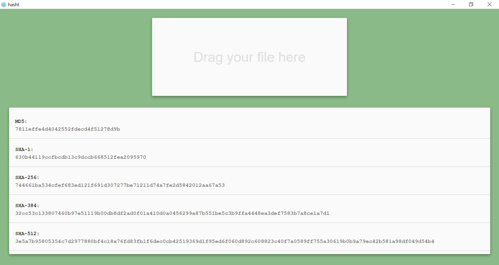

# HashT


**HashT** is a simple file hash calculator. Just drag and drop a file, to calculate hash.
These hash algorithms are supported: `MD5, SHA-1, SHA-256, SHA-384, SHA-512`

HashT has created with [Electron](https://github.com/electron/electron), so it's a cross platfrom standalone application.

## Get Started
install dependencies, build the application, and run
```
npm install
npm run build
npm run start
```

## Package as Executable
the easiest way is using [electron-packager](https://github.com/electron-userland/electron-packager). you can install it globaly, and run to generate Executable for all platfroms
```
npm install electron-packager -g
electron-packager . --all
```

## Open Source Licenses
- [electron](https://github.com/electron/electron/blob/master/LICENSE)
- [React](https://github.com/facebook/react/blob/master/LICENSE)
- [babel](https://github.com/babel/babel/blob/master/LICENSE)
- [webpack](https://github.com/webpack/webpack/blob/master/LICENSE)

## License
[MIT](LICENSE)
